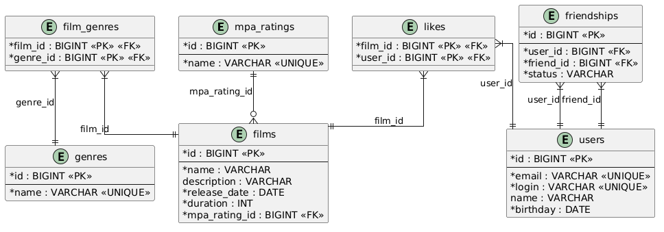

# java-filmorate

Template repository for Filmorate project.

## Схема базы данных



### Описание таблиц

| Таблица | Назначение |
|---|---|
| `users` | Пользователи (id, email, login, name, birthday) |
| `films` | Фильмы (id, name, description, release_date, duration, mpa_rating_id) |
| `mpa_ratings` | Справочник рейтингов MPA (G, PG, PG-13, R, NC-17) |
| `genres` | Справочник жанров (Комедия, Драма, Мультфильм, Триллер, Документальный, Боевик) |
| `film_genres` | Связь фильмы ↔ жанры (many-to-many) |
| `friendships` | Дружба пользователей со статусом (UNCONFIRMED / CONFIRMED) |
| `marks` | Оценки фильмов 1–10 (фильм ↔ пользователь, со значением) |

### Примеры SQL-запросов

**Получение всех фильмов:**
```sql
SELECT f.*, mr.name AS mpa_rating_name
FROM films f
JOIN mpa_ratings mr ON f.mpa_rating_id = mr.id;
```

**Получение всех пользователей:**
```sql
SELECT * FROM users;
```

**Топ N наиболее популярных фильмов (по средней оценке):**
```sql
SELECT f.*, AVG(m."value") AS rating
FROM films f
LEFT JOIN marks m ON f.id = m.film_id
GROUP BY f.id
ORDER BY rating DESC NULLS LAST
LIMIT 10;
```

**Список друзей пользователя:**
```sql
SELECT u.*
FROM users u
JOIN friendships fs ON (
    (fs.user_id = :userId AND fs.friend_id = u.id)
    OR (fs.friend_id = :userId AND fs.user_id = u.id)
)
WHERE fs.status = 'CONFIRMED';
```

**Общие друзья двух пользователей:**
```sql
SELECT u.*
FROM users u
WHERE u.id IN (
    SELECT fs.friend_id FROM friendships fs
    WHERE fs.user_id = :userId AND fs.status = 'CONFIRMED'
    UNION
    SELECT fs.user_id FROM friendships fs
    WHERE fs.friend_id = :userId AND fs.status = 'CONFIRMED'
)
AND u.id IN (
    SELECT fs.friend_id FROM friendships fs
    WHERE fs.user_id = :otherId AND fs.status = 'CONFIRMED'
    UNION
    SELECT fs.user_id FROM friendships fs
    WHERE fs.friend_id = :otherId AND fs.status = 'CONFIRMED'
);
```

**Жанры конкретного фильма:**
```sql
SELECT g.*
FROM genres g
JOIN film_genres fg ON g.id = fg.genre_id
WHERE fg.film_id = :filmId;
```
